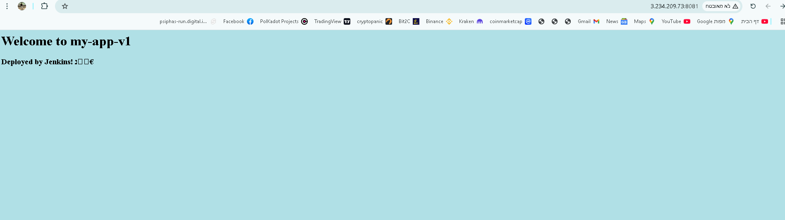
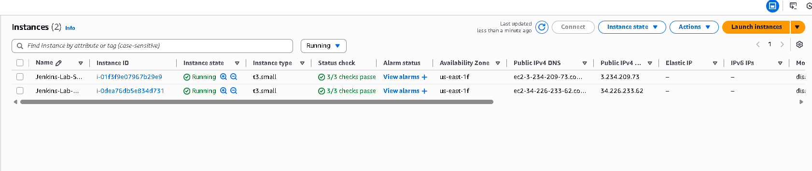
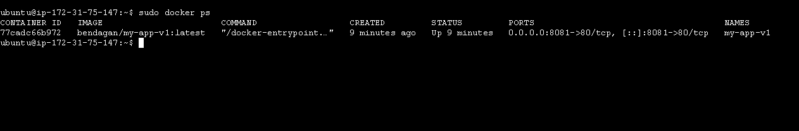

# End-to-End CI/CD Pipeline on AWS with Jenkins & Docker

This project demonstrates a complete DevOps workflow, automating the deployment of a containerized web application using a Master-Slave architecture on AWS.

## 🏗 Architecture
* **Infrastructure as Code:** Provisioned EC2 instances (Master & Agent) using **Terraform**.
* **CI/CD Orchestration:** **Jenkins** manages the pipeline.
* **Distributed Builds:** Heavy lifting (Docker build/push) is offloaded to a **Linux Agent Node**.
* **Containerization:** App is packaged with **Docker** and pushed to **Docker Hub**.
* **Deployment:** Automatic deployment to the agent server upon successful build.

## 🛠 Tech Stack
* **Cloud:** AWS (EC2, Security Groups, VPC)
* **IaC:** Terraform
* **CI/CD:** Jenkins (Pipeline as Code / Groovy)
* **Containerization:** Docker & DockerHub
* **OS:** Ubuntu Linux

## 🚀 Key Features
* **Dynamic Agents:** Utilization of a dedicated agent node via SSH.
* **Parameterized Builds:** User can choose which version (`v1` or `v2`) to deploy via Jenkins UI.
* **Automated Security:** SSH Key integration and minimal port exposure.
* **Self-Healing:** Pipeline handles cleanup of old containers before deploying new ones.

## 📸 Screenshots

### 1. The Deployment Pipeline Flow
*Visualizing the stages: Generate -> Build -> Push -> Deploy*

### 2. Live Application
*Successful deployment accessible via browser*

### 3. Infrastructure on AWS
*Master and Slave instances provisioned by Terraform*

### 4. Docker Verification
*Container running successfully on the agent*

## 📜 How to Run
1.  Clone the repo.
2.  Run `terraform apply` in the root directory.
3.  Configure Jenkins with DockerHub credentials and the Slave Node IP.
4.  Run the pipeline!